# DevOps Study Case #4

## Anggota Kelompok
| Nama | NRP |
| :--- | :--- |
| Arsyad Rizantha Maulana Salim| 5027221049 |
| Nathan Kho Pancras | 5027231002 |
| Farida Qurrotu A'yuna | 5027231015 |
| Nayla Raissa Azzahra | 5027231054 |
| Azza Farichi Tjahjono | 5027231071 |
| Nayyara Ashila | 5027231083 |

## Daftar Isi

- [DevOps Study Case #4](#devops-study-case-4)
  - [Anggota Kelompok](#anggota-kelompok)
  - [Daftar Isi](#daftar-isi)
  - [Gambaran Arsitektur](#gambaran-arsitektur)
  - [Spesifikasi VM](#spesifikasi-vm)
  - [Informasi Jaringan \& IP Address](#informasi-jaringan--ip-address)
    - [IP Address](#ip-address)
    - [URL Akses Layanan](#url-akses-layanan)
    - [Konfigurasi Jaringan](#konfigurasi-jaringan)
  - [Cara SSH ke VM](#cara-ssh-ke-vm)
    - [Set Permission File Key (wajib, hanya sekali)](#set-permission-file-key-wajib-hanya-sekali)
    - [SSH ke Application Node](#ssh-ke-application-node)
    - [SSH ke Monitoring Node](#ssh-ke-monitoring-node)
    - [Tips: Buat SSH Config (opsional, biar lebih praktis)](#tips-buat-ssh-config-opsional-biar-lebih-praktis)
  - [Firewall Rules (NSG)](#firewall-rules-nsg)
    - [Application Node — Ports yang Dibuka](#application-node--ports-yang-dibuka)
    - [Monitoring Node — Ports yang Dibuka](#monitoring-node--ports-yang-dibuka)
  - [Cara Menjalankan Ulang Terraform](#cara-menjalankan-ulang-terraform)
  - [Cara Menghapus Semua Resources](#cara-menghapus-semua-resources)
  - [Deployment Otomatis dengan Ansible](#deployment-otomatis-dengan-ansible)
    - [Struktur Folder Ansible](#struktur-folder-ansible)
    - [Prerequisites](#prerequisites)
    - [Struktur Inventory](#struktur-inventory)
    - [Cara Menjalankan Playbook](#cara-menjalankan-playbook)
    - [Ringkasan Fungsi Tiap Playbook](#ringkasan-fungsi-tiap-playbook)
    - [Testing](#testing)
  - [Prometheus dan Monitoring](#prometheus-dan-monitoring)
    - [Scope Implementasi](#scope-implementasi)
    - [Mapping Deliverables](#mapping-deliverables)
    - [Validasi Monitoring](#validasi-monitoring)
  - [Grafana Dashboard dan Integrasi](#grafana-dashboard-dan-integrasi)
    - [Scope Implementasi](#scope-implementasi-1)
    - [Mapping Deliverables](#mapping-deliverables-1)
    - [Validasi Grafana](#validasi-grafana)
    - [Akses Grafana](#akses-grafana)
  - [Load Testing dengan K6](#load-testing-dengan-k6)
    - [Lokasi Skrip](#lokasi-skrip)
    - [Cara Menjalankan](#cara-menjalankan)
    - [Validasi Data Masuk ke Grafana](#validasi-data-masuk-ke-grafana)
  - [Troubleshooting](#troubleshooting)
    - [SSH: "Permission denied (publickey)"](#ssh-permission-denied-publickey)
    - [SSH: "Connection timed out"](#ssh-connection-timed-out)
    - [Docker: Image tidak bisa di-pull](#docker-image-tidak-bisa-di-pull)
    - [Terraform: "Error acquiring the state lock"](#terraform-error-acquiring-the-state-lock)
    - [Kredit Azure Hampir Habis](#kredit-azure-hampir-habis)

---

## Gambaran Arsitektur

```
Internet
    │
    ├──── HTTP :3001 ──────► [ Application Node VM ]
    │                           Private IP: 10.0.1.10
    │                           - Web App / REST API
    │                           - Node Exporter (:9100)
    │
    └──── HTTP :3000 ──────► [ Monitoring Node VM ]
                                Private IP: 10.0.1.20
                                - Prometheus (:9090)
                                - Grafana (:3000)
                                - Alertmanager (:9093)

Kedua VM berada dalam satu Virtual Network (VNet) yang sama,
sehingga bisa saling berkomunikasi melalui private IP secara langsung.
```

---

## Spesifikasi VM

Kedua VM menggunakan spesifikasi yang **identik**:

| Spesifikasi | Detail |
|---|---|
| **VM Size** | `Standard_B2ps_v2` |
| **vCPU** | 2 Core |
| **RAM** | 4 GB |
| **Storage (OS Disk)** | 30 GB (Standard LRS) |
| **Sistem Operasi** | Ubuntu 22.04 LTS |
| **⚠️ Arsitektur CPU** | **ARM64 / AArch64** |
| **OS Image SKU** | `22_04-lts-arm64` |
| **Region Azure** | Southeast Asia (Singapore) |
| **Admin Username** | `azureuser` |
| **Metode Login** | SSH Key (password dinonaktifkan) |

> Dikarenakan batasan kapasitas di region Southeast Asia, kedua VM ini menggunakan arsitektur ARM64 (Aarch64). Seluruh anggota tim wajib memastikan bahwa setiap Docker image, base image, maupun binary yang digunakan pada tahap selanjutnya telah mendukung arsitektur linux/arm64 agar sistem dapat berjalan dengan normal.

---

## Informasi Jaringan & IP Address

### IP Address

| Node | Public IP | Private IP | Fungsi |
|---|---|---|---|
| **Application Node** | `4.193.141.181` | `10.0.1.10` | Web App + Node Exporter |
| **Monitoring Node** | `20.205.153.210` | `10.0.1.20` | Prometheus + Grafana |

### URL Akses Layanan

| Layanan | URL | Keterangan |
|---|---|---|
| **Aplikasi** | `http://4.193.141.181:3001` | Endpoint API utama |
| **Grafana Dashboard** | `http://20.205.153.210:3000` | Visualisasi metrik |
| **Prometheus UI** | `http://20.205.153.210:9090` | Hanya dari dalam VNet |
| **Node Exporter** | `http://10.0.1.10:9100/metrics` | Hanya dari dalam VNet |
| **Alertmanager** | `http://20.205.153.210:9093` | Hanya dari dalam VNet |

### Konfigurasi Jaringan

| Resource | Detail |
|---|---|
| **Resource Group** | `devops-monitoring-dev-rg` |
| **Virtual Network** | `devops-monitoring-vnet` (`10.0.0.0/16`) |
| **Subnet** | `devops-monitoring-subnet` (`10.0.1.0/24`) |

---

## Cara SSH ke VM

### Set Permission File Key (wajib, hanya sekali)

```bash
chmod 600 ~/.ssh/devops-project.pem
```

> Tanpa langkah ini, SSH akan menolak key dengan error "Permissions too open".

### SSH ke Application Node

```bash
ssh -i ~/.ssh/devops-project.pem azureuser@4.193.141.181
```

### SSH ke Monitoring Node

```bash
ssh -i ~/.ssh/devops-project.pem azureuser@20.205.153.210
```

### Tips: Buat SSH Config (opsional, biar lebih praktis)

Tambahkan konfigurasi berikut ke file `~/.ssh/config` agar bisa SSH hanya dengan `ssh app-node`:

```
Host app-node
    HostName 4.193.141.181
    User azureuser
    IdentityFile ~/.ssh/devops-project.pem

Host monitoring-node
    HostName 20.205.153.210
    User azureuser
    IdentityFile ~/.ssh/devops-project.pem
```

Setelah itu cukup jalankan:
```bash
ssh app-node
ssh monitoring-node
```

---

## Firewall Rules (NSG)

### Application Node — Ports yang Dibuka

| Port | Protokol | Sumber | Fungsi |
|---|---|---|---|
| `22` | TCP | `0.0.0.0/0` | SSH |
| `3001` | TCP | `0.0.0.0/0` | Akses aplikasi dari internet |
| `9100` | TCP | `10.0.0.0/16` (VNet only) | Node Exporter — scraping Prometheus |
| `9091` | TCP | `10.0.0.0/16` (VNet only) | Custom app metrics |

### Monitoring Node — Ports yang Dibuka

| Port | Protokol | Sumber | Fungsi |
|---|---|---|---|
| `22` | TCP | `0.0.0.0/0` | SSH |
| `3000` | TCP | `0.0.0.0/0` | Akses Grafana dari internet |
| `9090` | TCP | `10.0.0.0/16` (VNet only) | Prometheus UI |
| `9093` | TCP | `10.0.0.0/16` (VNet only) | Alertmanager |

> **Catatan keamanan:** Port Prometheus dan Alertmanager sengaja hanya bisa diakses dari dalam VNet (private), bukan dari internet publik. Kalau kamu perlu akses Prometheus UI dari laptopmu, gunakan SSH tunneling:
> ```bash
> ssh -i ~/.ssh/devops-project.pem -L 9090:localhost:9090 azureuser@20.205.153.210
> # Lalu buka http://localhost:9090 di browser
> ```

---


## Cara Menjalankan Ulang Terraform

Jika ada perubahan konfigurasi infrastruktur yang diperlukan:

```bash
# Masuk ke folder terraform
cd ~/devops-project/terraform

# Pastikan masih login ke Azure
az account show

# Kalau sudah logout, login lagi
az login

# Preview perubahan
terraform plan

# Terapkan perubahan
terraform apply
```

---

## Cara Menghapus Semua Resources

> **PENTING:** Lakukan ini hanya setelah project selesai dan semua screenshot/dokumentasi sudah disimpan.
> Menghapus resources akan menghentikan VM dan menghemat kredit Azure.

```bash
cd ~/devops-project/terraform
terraform destroy
# Ketik 'yes' saat diminta konfirmasi
```

Semua resources di Azure (VM, VNet, NSG, Public IP, dll) akan dihapus dalam ~5 menit.

---

## Deployment Otomatis dengan Ansible

Semua deployment aplikasi, monitoring stack, dan provisioning Grafana dijalankan dari control machine menggunakan Ansible.

- `app_node`: deploy aplikasi Node.js di port `3001`, expose endpoint metrics aplikasi (`/metrics`), dan aktifkan Node Exporter (`9100`).
- `monitoring_node`: siapkan Docker Engine, Docker Compose plugin, lalu deploy Prometheus, Alertmanager, dan Grafana.

### Struktur Folder Ansible

```text
ansible/
├── ansible.cfg
├── inventory.ini
├── playbooks/
│   ├── dependencies.yml
│   ├── monitoring.yml
│   ├── app-deploy.yml
│   └── grafana.yml
├── templates/
│   ├── devops-app.compose.yml.j2
│   ├── monitoring.compose.yml.j2
│   ├── monitoring-stack.service.j2
│   ├── grafana.compose.yml.j2
│   ├── grafana.service.j2
│   └── devops-app.service.j2
├── files/
│   ├── prometheus/
│   ├── alertmanager/
│   └── grafana/
└── roles/
```

### Prerequisites

Install Ansible di control machine:

```bash
pip install ansible
```

### Struktur Inventory

Inventory statis menggunakan dua grup host:

- `app_node`
- `monitoring_node`

Host aktif saat ini mengikuti output Terraform:

- Application Node: `4.193.141.181`
- Monitoring Node: `20.205.153.210`

Jika Terraform dijalankan ulang dan IP berubah, perbarui `ansible/inventory.ini`.

### Cara Menjalankan Playbook

Jalankan dari root project:

```bash
cd ansible

# Uji koneksi SSH
ansible all -m ping

# Dependency seluruh node
ansible-playbook playbooks/dependencies.yml

# Deploy aplikasi ke app_node
ansible-playbook playbooks/app-deploy.yml

# Deploy Prometheus + Alertmanager ke monitoring_node
ansible-playbook playbooks/monitoring.yml

# Deploy Grafana + provisioning dashboard/datasource
ansible-playbook playbooks/grafana.yml
```

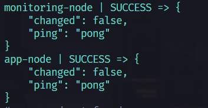 

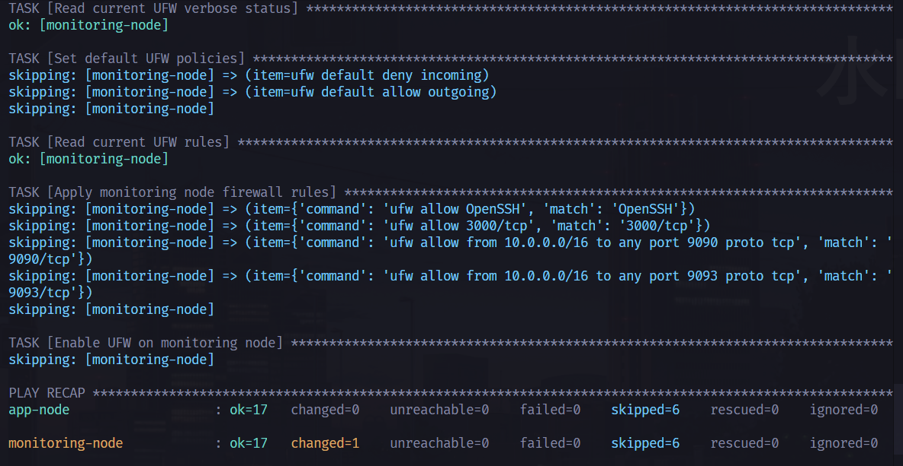 

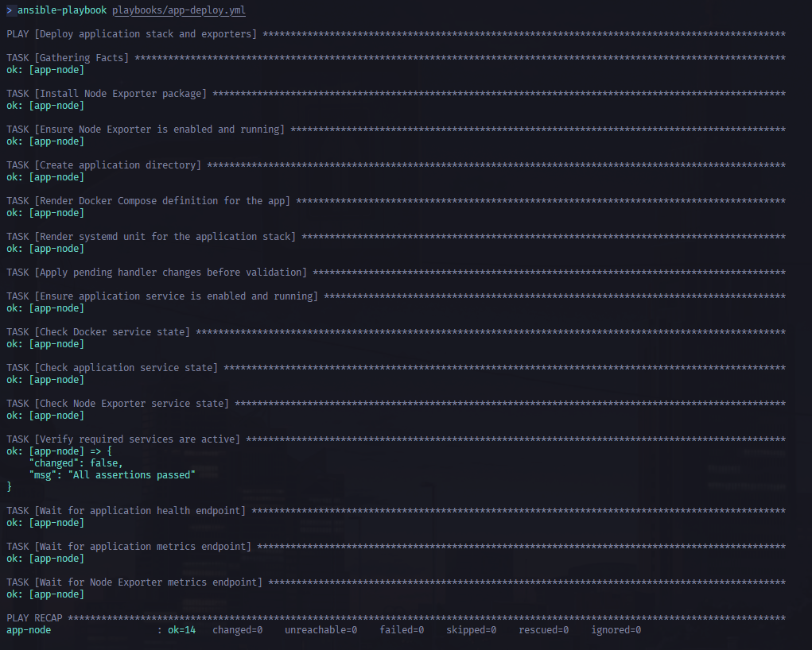

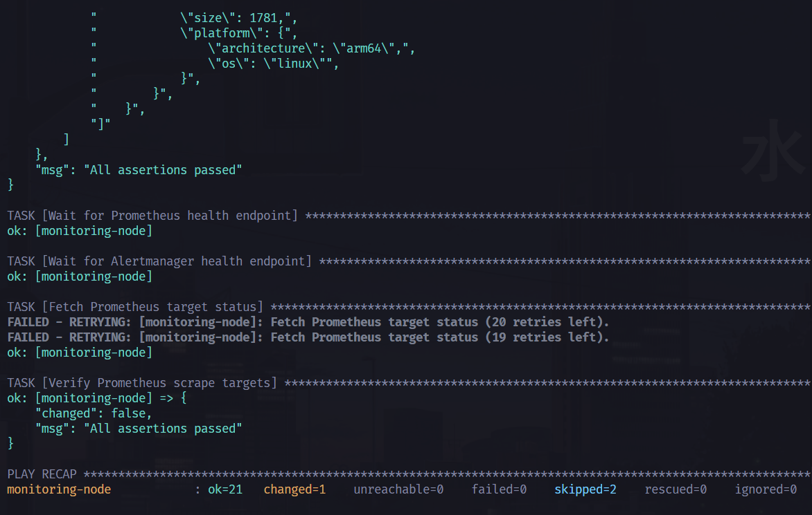

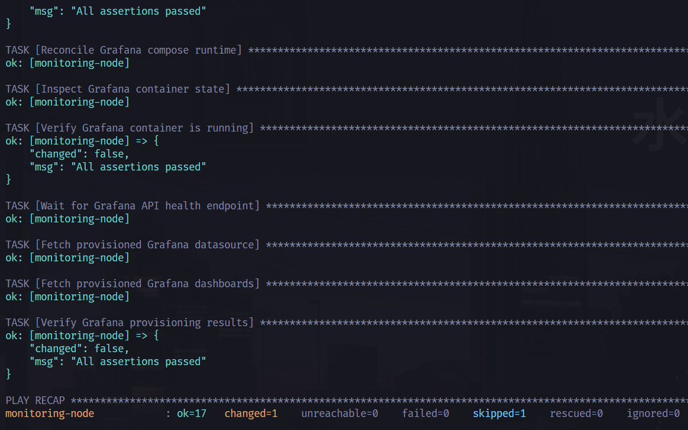 

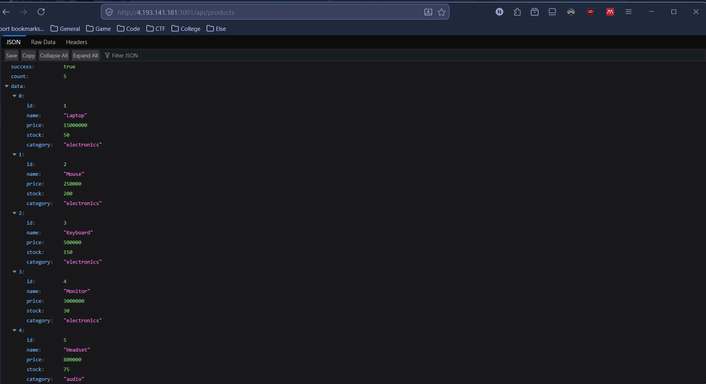 

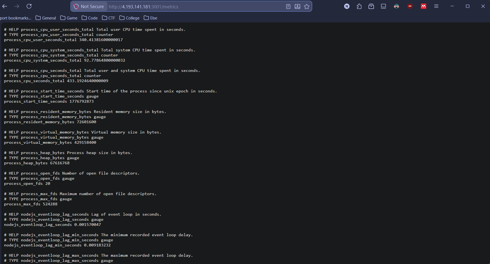

### Ringkasan Fungsi Tiap Playbook

`playbooks/dependencies.yml`

- install Docker Engine
- install Docker Compose plugin (`docker compose`)
- tambah user `azureuser` ke grup `docker`
- aktifkan service Docker
- konfigurasi UFW per role node

`playbooks/app-deploy.yml`

- install `prometheus-node-exporter`
- render Docker Compose aplikasi (`trenttzzz/devops-app:latest`)
- jalankan aplikasi di port `3001`
- buat service systemd `devops-app.service`
- validasi status service dan endpoint `/health`, `/metrics`, dan Node Exporter

`playbooks/monitoring.yml`

- install dan pastikan `prometheus-node-exporter` aktif di monitoring node
- copy `prometheus.yml`, `alerting-rules.yml`, dan `alertmanager.yml`
- render Docker Compose + systemd unit `monitoring-stack`
- jalankan Prometheus + Alertmanager dengan volume persistence
- lakukan runtime reconcile dengan `docker compose up -d --remove-orphans`
- verifikasi container `prometheus` dan `alertmanager` benar-benar running
- validasi health endpoint `/-/healthy` (Prometheus) dan `/-/ready` (Alertmanager)
- validasi target scrape utama (`application`, `node_exporter`, `prometheus`, `alertmanager`) dalam status up

`playbooks/grafana.yml`

- siapkan direktori `/opt/grafana` (data, provisioning, dashboards)
- copy provisioning datasource + dashboard
- seed 3 dashboard: `app-observability`, `infrastructure-overview`, `k6-traceability`
- render Docker Compose + systemd unit `grafana-stack`
- lakukan runtime reconcile dengan `docker compose up -d --remove-orphans`
- verifikasi container `grafana` benar-benar running
- validasi Grafana health API, datasource Prometheus (`uid=prometheus`), dan jumlah dashboard terprovision

### Testing

Setelah deployment awal berhasil, jalankan ulang playbook berikut:

```bash
ansible-playbook playbooks/dependencies.yml
ansible-playbook playbooks/app-deploy.yml
ansible-playbook playbooks/monitoring.yml
ansible-playbook playbooks/grafana.yml
```

Output yang diharapkan:

```text
changed=0
failed=0
```

Validasi cepat dari control machine:

```bash
ansible app_node -m shell -a "systemctl is-active docker devops-app prometheus-node-exporter"
ansible app_node -m shell -a "curl -fsS http://127.0.0.1:3001/health && curl -fsS http://127.0.0.1:3001/metrics >/dev/null"
ansible monitoring_node -m shell -a "systemctl is-active monitoring-stack grafana-stack prometheus-node-exporter"
ansible monitoring_node -m shell -a "curl -fsS http://127.0.0.1:9090/-/healthy && curl -fsS http://127.0.0.1:9093/-/ready && curl -fsS http://127.0.0.1:3000/api/health"
```

## Prometheus dan Monitoring

### Scope Implementasi

1. **Prometheus configuration**
  - Global scrape/evaluation interval dan external labels sudah dikonfigurasi.
  - Scrape target mencakup:
    - Prometheus server (`localhost:9090`)
    - Alertmanager (`localhost:9093`)
    - Application metrics (`10.0.1.10:3001/metrics`)
    - Node Exporter di kedua VM (`10.0.1.10:9100` dan `10.0.1.20:9100`)
2. **Deployment via Ansible + Docker Compose**
  - Prometheus dan Alertmanager dideploy menggunakan template Compose.
  - Data persistence disiapkan pada:
    - `/opt/monitoring/prometheus/data`
    - `/opt/monitoring/alertmanager/data`
  - Retention policy Prometheus aktif melalui argumen `--storage.tsdb.retention.time` (default `15d`).
3. **Alerting rules**
  - Rule infrastruktur: high CPU usage dan low memory available.
  - Rule aplikasi: high response latency (p95) dan high error rate (5xx).
4. **Alertmanager setup**
  - Receiver default aktif (`default-log`).
  - Template integrasi Telegram/Slack disiapkan sebagai referensi nilai tambah.

### Mapping Deliverables

- `prometheus.yml`: `ansible/files/prometheus/prometheus.yml`
- `alerting-rules.yml`: `ansible/files/prometheus/alerting-rules.yml`
- `alertmanager.yml`: `ansible/files/alertmanager/alertmanager.yml`
- `playbook-monitoring-stack.yml`: implementasi saat ini di `ansible/playbooks/monitoring.yml`

### Validasi Monitoring

```bash
# Cek status service monitoring
ansible monitoring_node -m shell -a "systemctl is-active monitoring-stack prometheus-node-exporter"

# Cek endpoint health lokal
ansible monitoring_node -m shell -a "curl -fsS http://127.0.0.1:9090/-/healthy && curl -fsS http://127.0.0.1:9093/-/ready"

# Cek scrape pool aktif
ansible monitoring_node -m shell -a "curl -fsS http://127.0.0.1:9090/api/v1/targets | jq -r '.data.activeTargets[].scrapePool'"
```

Port forwarding lokal untuk Prometheus UI:

```bash
ssh -i ~/.ssh/devops-project.pem -L 9090:localhost:9090 azureuser@20.205.153.210
```

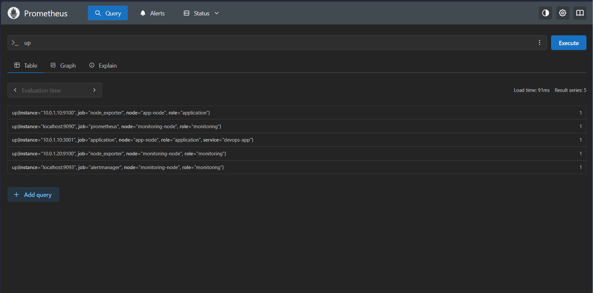 

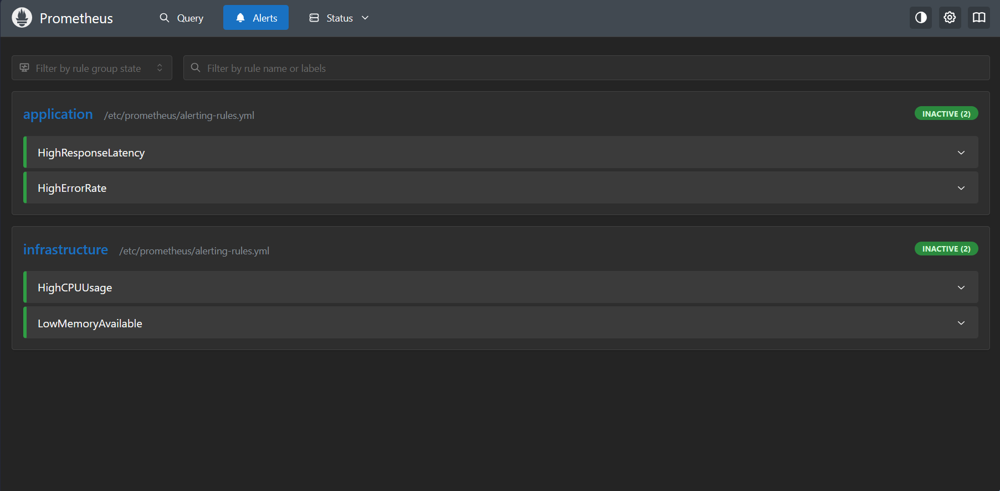 

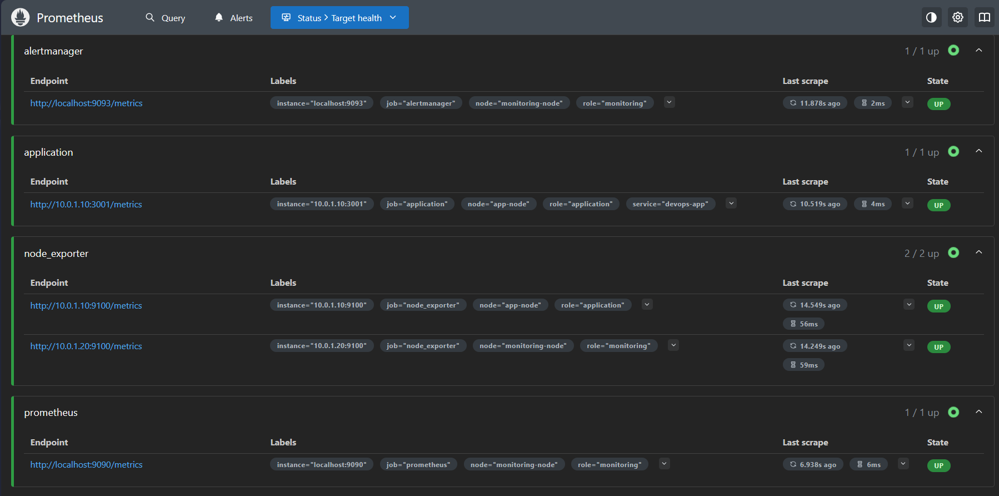 

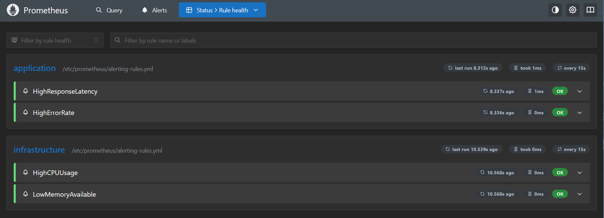

## Grafana Dashboard dan Integrasi

### Scope Implementasi

1. **Grafana deployment via Ansible + Docker Compose**
  - Service Grafana berjalan terpisah sebagai `grafana-stack` di monitoring node.
  - Persistent storage ada di `/opt/grafana/data`.
2. **Datasource auto-configuration**
  - Datasource Prometheus diprovision otomatis dengan UID `prometheus`.
3. **Dashboard provisioning otomatis**
  - Provider file-based aktif dari path `/var/lib/grafana/dashboards`.
  - Dashboard disinkronkan saat service start/restart.
4. **Dashboard coverage**
  - `app-observability`
  - `infrastructure-overview` (termasuk panel observability Alertmanager)
  - `k6-traceability`

### Mapping Deliverables

- `playbook-grafana-setup.yml`: implementasi saat ini di `ansible/playbooks/grafana.yml`
- Dashboard JSON:
  - `ansible/files/grafana/dashboards/app-observability.json`
  - `ansible/files/grafana/dashboards/infrastructure-overview.json`
  - `ansible/files/grafana/dashboards/k6-traceability.json`
- Datasource provisioning:
  - `ansible/files/grafana/provisioning/datasources/grafana-datasource.yml`
- Dashboard provisioning:
  - `ansible/files/grafana/provisioning/dashboards/grafana-dashboard-provisioning.yml`

### Validasi Grafana

```bash
# Cek service Grafana
ansible monitoring_node -m shell -a "systemctl is-active grafana-stack"

# Cek health API
ansible monitoring_node -m shell -a "curl -fsS http://127.0.0.1:3000/api/health"

# Cek datasource Prometheus
ansible monitoring_node -m shell -a "curl -u admin:admin -fsS http://127.0.0.1:3000/api/datasources/name/Prometheus | jq '.uid'"

# Cek jumlah dashboard ter-load
ansible monitoring_node -m shell -a "curl -u admin:admin -fsS 'http://127.0.0.1:3000/api/search?query=' | jq '[.[] | select(.type==\"dash-db\")] | length'"
```

### Akses Grafana

- URL: `http://20.205.153.210:3000`
- Default credential:
  - Username: `admin`
  - Password: `admin`

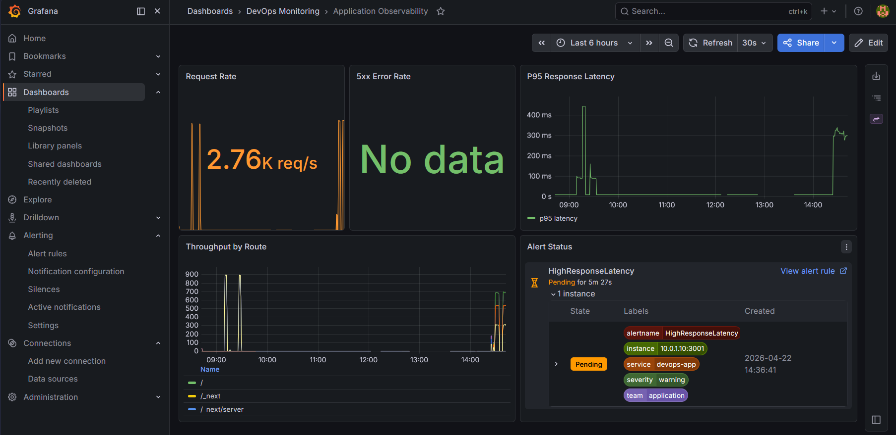 

 

 

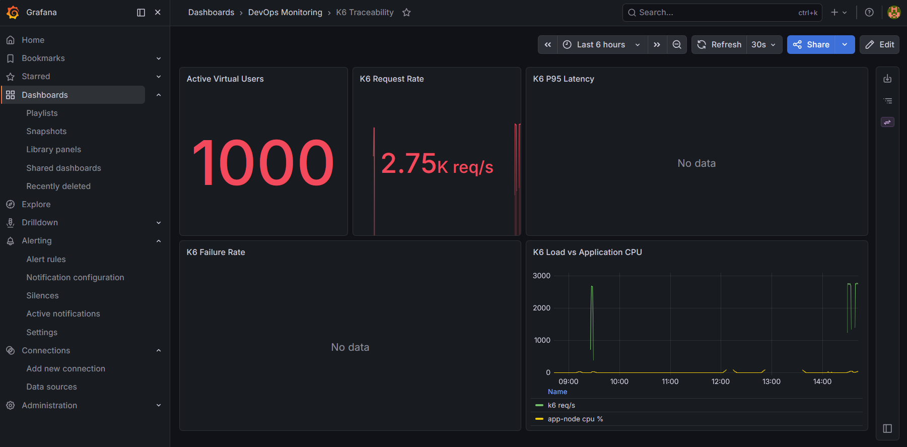

---

## Load Testing dengan K6

Section ini digunakan untuk menjalankan uji beban `1000 VU selama 5 menit` dan mengirim metrik k6 ke Prometheus agar bisa divisualisasikan di dashboard `k6-traceability`.

### Lokasi Skrip

- Skrip: `k6/load-test.js`
- Karakteristik test:
  - executor `constant-vus`
  - `vus: 1000`
  - `duration: 5m`
  - endpoint mix: `/health`, `/api/users`, `/api/users/:id`, `/api/products`, `/api/products/:id`
  - threshold default:
    - `http_req_failed < 5%`
    - `p95 http_req_duration < 200ms`
    - `checks > 99%`

### Cara Menjalankan

Contoh eksekusi dari monitoring node:

```bash
cd ~/devops-mini-project

# Jalankan load test dan kirim metrik ke Prometheus Remote Write
BASE_URL=http://4.193.141.181:3001 \
K6_PROMETHEUS_RW_SERVER_URL=http://127.0.0.1:9090/api/v1/write \
k6 run -o experimental-prometheus-rw k6/load-test.js
```

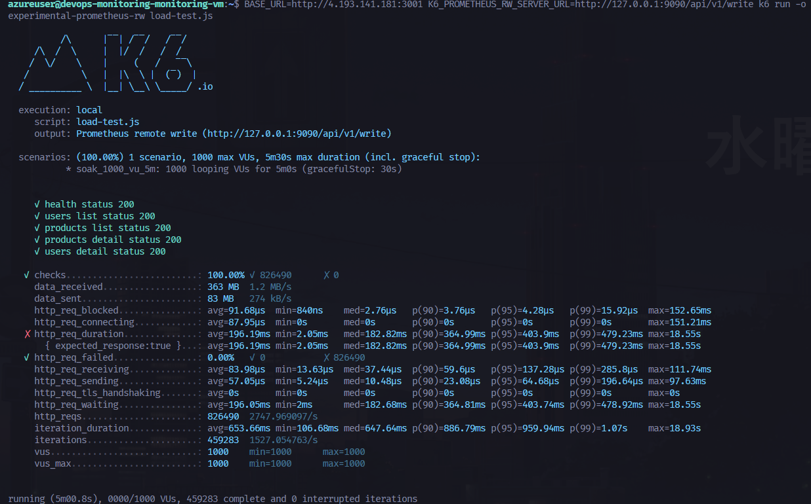


### Validasi Data Masuk ke Grafana

Setelah test berjalan 1-2 menit, buka dashboard `K6 Traceability` di Grafana, lalu cek panel berikut:

- `Active Virtual Users`
- `K6 Request Rate`
- `K6 P95 Latency`
- `K6 Failure Rate`
- `K6 Load vs Application CPU`

Query Prometheus yang bisa dipakai untuk sanity check:

```promql
max(k6_vus)
sum(rate(k6_http_reqs_total[1m]))
histogram_quantile(0.95, sum(rate(k6_http_req_duration_seconds_bucket[1m])) by (le))
```

Catatan penting:

- Threshold yang tampil di output `k6 run` adalah evaluasi lokal di runner k6.
- Alertmanager hanya menerima alert dari rule Prometheus (`alerting-rules.yml`), bukan langsung dari threshold k6.
- Project ini menambahkan rule khusus k6 (`K6HighRequestLatency` dan `K6HighFailureRate`) agar alert bisa dikirim ke Alertmanager saat load test.

Cek status alert dari monitoring node:

```bash
# Alert state di Prometheus
curl -fsS http://127.0.0.1:9090/api/v1/alerts | jq '.data.alerts[] | {name: .labels.alertname, state: .state, activeAt: .activeAt}'

# Alert yang diterima Alertmanager
curl -fsS http://127.0.0.1:9093/api/v2/alerts | jq '.[].labels.alertname'
```

Jika muncul error `got status code: 404` saat remote write, aktifkan receiver Prometheus lalu redeploy monitoring stack:

```bash
cd ~/devops-mini-project/ansible
ansible-playbook playbooks/monitoring.yml
```

Quick check dari monitoring node:

```bash
docker logs prometheus 2>&1 | grep -i remote-write
```

---

## Troubleshooting

### SSH: "Permission denied (publickey)"

```bash
# Pastikan permission file key sudah benar
chmod 600 ~/.ssh/devops-project.pem

# Coba dengan verbose untuk lihat detail error
ssh -v -i ~/.ssh/devops-project.pem azureuser@4.193.141.181
```

### SSH: "Connection timed out"

VM mungkin sedang reboot atau belum fully booted. Tunggu 2-3 menit lalu coba lagi.
Bisa juga cek status VM di Azure Portal → Virtual Machines.

### Docker: Image tidak bisa di-pull

Pastikan image yang digunakan mendukung ARM64. Cek dengan:
```bash
# Di dalam VM (setelah SSH)
uname -m  # Harusnya: aarch64

# Test pull image
docker pull node:20-alpine
docker run --rm node:20-alpine node --version
```

### Terraform: "Error acquiring the state lock"

```bash
terraform force-unlock <LOCK_ID>
```

### Kredit Azure Hampir Habis

Matikan VM sementara via Azure Portal atau:
```bash
az vm deallocate --resource-group devops-monitoring-dev-rg --name devops-monitoring-app-vm
az vm deallocate --resource-group devops-monitoring-dev-rg --name devops-monitoring-monitoring-vm
```

Untuk menyalakan kembali:
```bash
az vm start --resource-group devops-monitoring-dev-rg --name devops-monitoring-app-vm
az vm start --resource-group devops-monitoring-dev-rg --name devops-monitoring-monitoring-vm
```

> **Catatan:** Setelah VM dinyalakan kembali, **Public IP bisa berubah** jika menggunakan Dynamic IP. Karena kita menggunakan Static IP (`allocation_method = "Static"`), IP address **tidak akan berubah**.
> 
---
