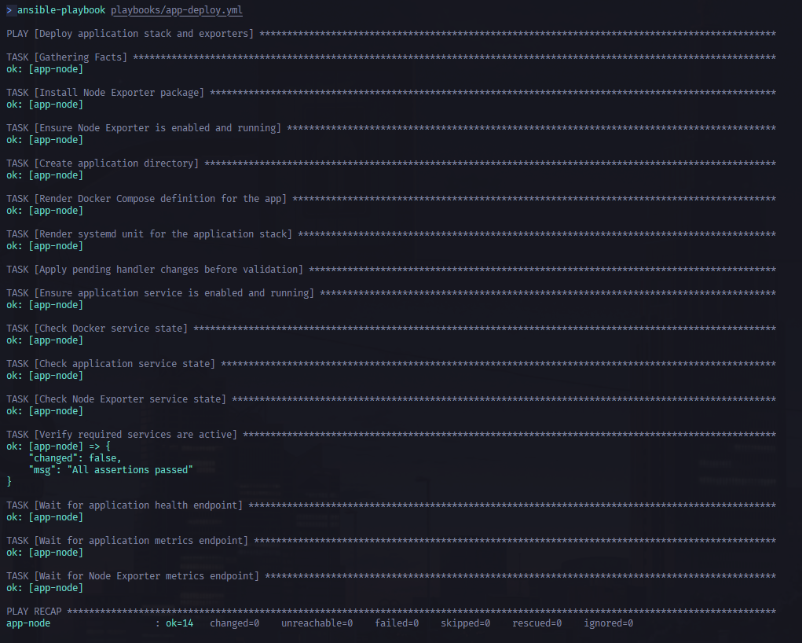
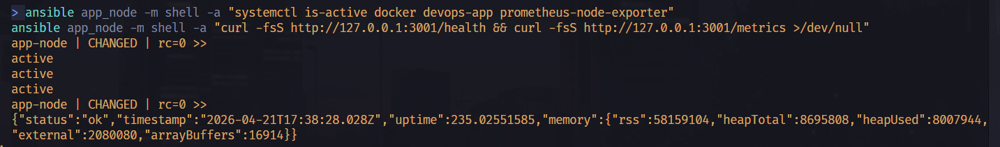

# Ansible Deployment Guide

- [Ansible Deployment Guide](#ansible-deployment-guide)
  - [Struktur Folder](#struktur-folder)
  - [Prerequisites](#prerequisites)
  - [Struktur Inventory](#struktur-inventory)
  - [How to Run](#how-to-run)
  - [Apa yang Dilakukan Playbook](#apa-yang-dilakukan-playbook)
    - [`playbook-dependencies.yml`](#playbook-dependenciesyml)
    - [`playbook-app-deployment.yml`](#playbook-app-deploymentyml)
  - [Testing](#testing)

> VM sudah diprovision dengan Terraform.

- `app_node`: deploy aplikasi Node.js, expose app di port `3001`, expose endpoint metrics aplikasi di port yang sama (`3001/metrics`), dan aktifkan Node Exporter di port `9100`
- `monitoring_node`: siapkan Docker Engine, Docker Compose plugin, dan firewall untuk Grafana/Prometheus/Alertmanager

## Struktur Folder

```text
ansible/
├── ansible.cfg
├── inventory.ini
├── playbooks/
│   ├── dependencies.yml
│   └── app-deploy.yml
├── templates/
│   ├── devops-app.compose.yml.j2
│   └── devops-app.service.j2
├── files/
└── roles/
```

## Prerequisites

Install Ansible di control machine:

```bash
pip install ansible
```

## Struktur Inventory

Inventory statis memakai dua group:

- `app_node`
- `monitoring_node`

Host yang dipakai saat ini mengikuti output Terraform:

- Application Node: `4.193.141.181`
- Monitoring Node: `20.205.153.210`

Semisal Terraform perlu di rerun bisa update `inventory.ini`.

## How to Run

Masuk ke folder Ansible:

```bash
cd ansible
```

Uji koneksi SSH dulu:

```bash
ansible all -m ping
```

Jalankan playbook dependency untuk semua node:

```bash
ansible-playbook playbooks/dependencies.yml
```

Jalankan playbook deployment aplikasi untuk `app_node`:

```bash
ansible-playbook playbooks/app-deploy.yml
```

## Apa yang Dilakukan Playbook

### `playbook-dependencies.yml`

- install Docker Engine
- install Docker Compose plugin (`docker compose`)
- tambah user `azureuser` ke group `docker`
- aktifkan service Docker
- konfigurasi UFW sesuai kebutuhan tiap node

### `playbook-app-deployment.yml`

- install `prometheus-node-exporter`
- buat Docker Compose file untuk image `trenttzzz/devops-app:latest`
- jalankan aplikasi di port `3001`
- expose endpoint aplikasi dan metrics melalui port host yang sama, yaitu `3001`
- buat systemd unit `devops-app.service`
- validasi `docker`, `devops-app`, dan `prometheus-node-exporter` dalam kondisi running
- validasi endpoint `/health`, `/metrics`, dan Node Exporter metrics

## Testing 

Setelah playbook sukses dijalankan sekali, ulangi kedua command berikut:

```bash
ansible-playbook playbooks/dependencies.yml
ansible-playbook playbooks/app-deploy.yml
```

Playbook yang idempotent seharusnya berakhir dengan recap yang mendekati:

```text
changed=0
failed=0
```

Untuk validasi service dari control machine, bisa juga jalankan:

```bash
ansible app_node -m shell -a "systemctl is-active docker devops-app prometheus-node-exporter"
ansible app_node -m shell -a "curl -fsS http://127.0.0.1:3001/health && curl -fsS http://127.0.0.1:3001/metrics >/dev/null"
```



