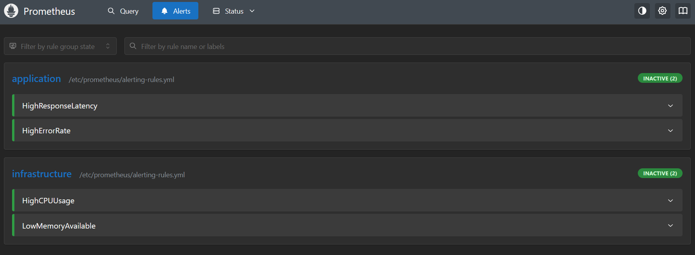
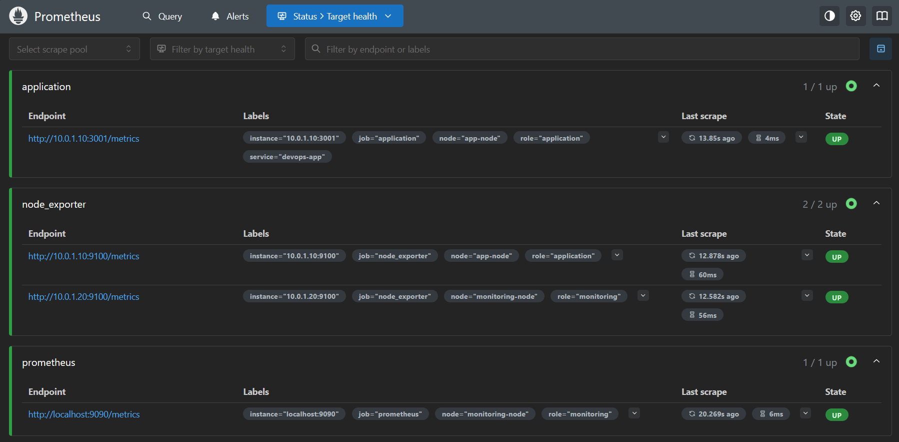
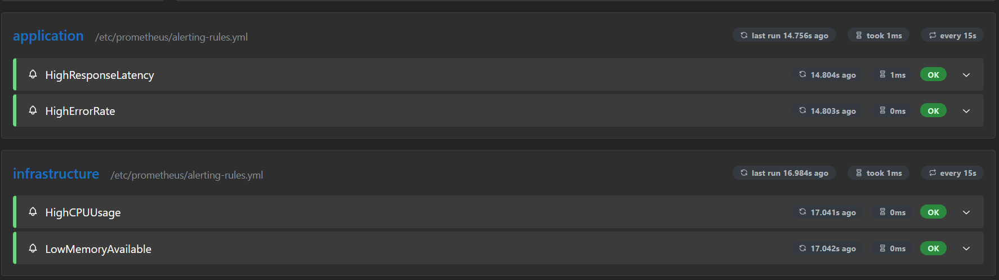
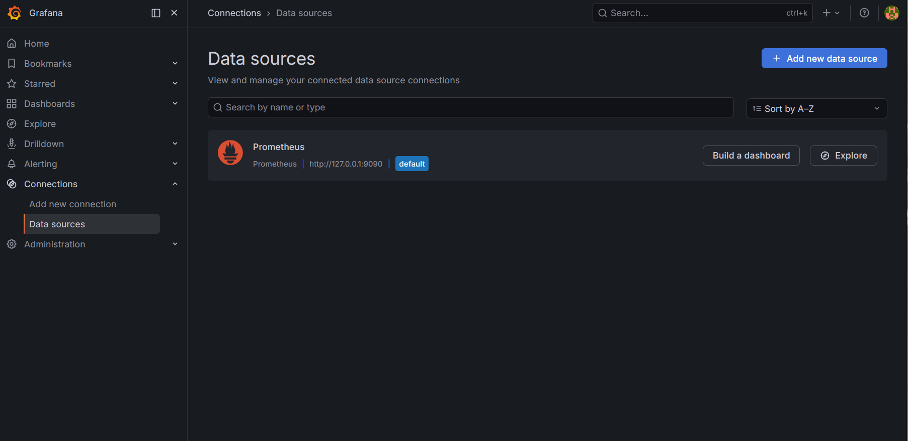
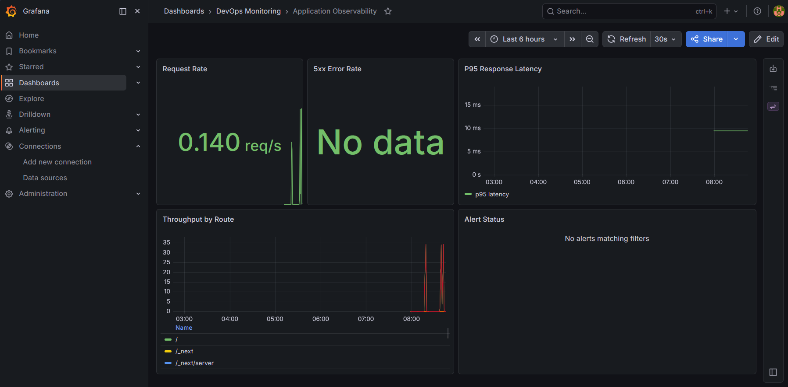
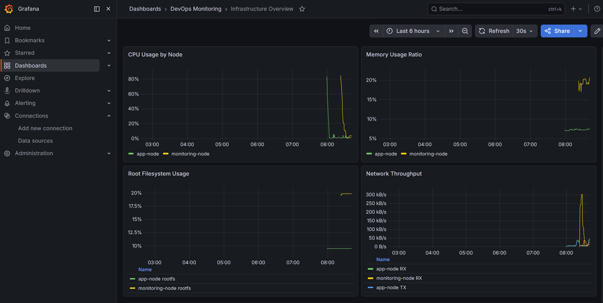

# Ansible Deployment Guide

- [Ansible Deployment Guide](#ansible-deployment-guide)
  - [Struktur Folder](#struktur-folder)
  - [Prerequisites](#prerequisites)
  - [Struktur Inventory](#struktur-inventory)
  - [How to Run](#how-to-run)
  - [Apa yang Dilakukan Playbook](#apa-yang-dilakukan-playbook)
    - [`playbook-dependencies.yml`](#playbook-dependenciesyml)
    - [`playbook-app-deployment.yml`](#playbook-app-deploymentyml)
    - [`playbook-monitoring-stack.yml`](#playbook-monitoring-stackyml)
    - [`playbook-grafana-setup.yml`](#playbook-grafana-setupyml)
  - [Testing](#testing)
  - [Prometheus \& Monitoring Configuration](#prometheus--monitoring-configuration)
    - [Scope Implementasi](#scope-implementasi)
    - [Mapping Deliverables](#mapping-deliverables)
    - [Cara Deploy / Re-deploy](#cara-deploy--re-deploy)
    - [Validasi](#validasi)
  - [Grafana Dashboard \& Integration](#grafana-dashboard--integration)
    - [Scope Implementasi](#scope-implementasi-1)
    - [Mapping Deliverables](#mapping-deliverables-1)
    - [Cara Deploy / Re-deploy](#cara-deploy--re-deploy-1)
    - [Validasi](#validasi-1)
    - [Akses Grafana](#akses-grafana)

> VM sudah diprovision dengan Terraform.

- `app_node`: deploy aplikasi Node.js, expose app di port `3001`, expose endpoint metrics aplikasi di port yang sama (`3001/metrics`), dan aktifkan Node Exporter di port `9100`
- `monitoring_node`: siapkan Docker Engine, Docker Compose plugin, dan firewall untuk Grafana/Prometheus/Alertmanager

## Struktur Folder

```text
ansible/
├── ansible.cfg
├── inventory.ini
├── playbooks/
│   ├── dependencies.yml
│   ├── monitoring.yml
│   ├── app-deploy.yml
│   └── grafana.yml
├── templates/
│   ├── devops-app.compose.yml.j2
│   ├── monitoring.compose.yml.j2
│   ├── monitoring-stack.service.j2
│   ├── grafana.compose.yml.j2
│   ├── grafana.service.j2
│   └── devops-app.service.j2
├── files/
│   ├── prometheus/
│   ├── alertmanager/
│   └── grafana/
└── roles/
```

## Prerequisites

Install Ansible di control machine:

```bash
pip install ansible
```

## Struktur Inventory

Inventory statis memakai dua group:

- `app_node`
- `monitoring_node`

Host yang dipakai saat ini mengikuti output Terraform:

- Application Node: `4.193.141.181`
- Monitoring Node: `20.205.153.210`

Semisal Terraform perlu di rerun bisa update `inventory.ini`.

## How to Run

Masuk ke folder Ansible:

```bash
cd ansible
```

Uji koneksi SSH dulu:

```bash
ansible all -m ping
```

Jalankan playbook dependency untuk semua node:

```bash
ansible-playbook playbooks/dependencies.yml
```

Jalankan playbook deployment aplikasi untuk `app_node`:

```bash
ansible-playbook playbooks/app-deploy.yml
```

Jalankan playbook monitoring stack untuk `monitoring_node`:

```bash
ansible-playbook playbooks/monitoring.yml
```

Jalankan playbook Grafana untuk `monitoring_node`:

```bash
ansible-playbook playbooks/grafana.yml
```

## Apa yang Dilakukan Playbook

### `playbook-dependencies.yml`

- install Docker Engine
- install Docker Compose plugin (`docker compose`)
- tambah user `azureuser` ke group `docker`
- aktifkan service Docker
- konfigurasi UFW sesuai kebutuhan tiap node

### `playbook-app-deployment.yml`

- install `prometheus-node-exporter`
- buat Docker Compose file untuk image `trenttzzz/devops-app:latest`
- jalankan aplikasi di port `3001`
- expose endpoint aplikasi dan metrics melalui port host yang sama, yaitu `3001`
- buat systemd unit `devops-app.service`
- validasi `docker`, `devops-app`, dan `prometheus-node-exporter` dalam kondisi running
- validasi endpoint `/health`, `/metrics`, dan Node Exporter metrics

### `playbook-monitoring-stack.yml`

- implementasi saat ini ada di `playbooks/monitoring.yml`
- install dan pastikan `prometheus-node-exporter` aktif di `monitoring_node`
- copy `prometheus.yml`, `alerting-rules.yml`, dan `alertmanager.yml` ke `/opt/monitoring`
- render Docker Compose + systemd unit untuk service `monitoring-stack`
- jalankan Prometheus + Alertmanager dengan persistent volume
- validasi endpoint health `/-/healthy` (Prometheus) dan `/-/ready` (Alertmanager)
- validasi scrape target penting (`application`, `node_exporter`, `prometheus`) dalam status `up`

### `playbook-grafana-setup.yml`

- implementasi saat ini ada di `playbooks/grafana.yml`
- siapkan direktori `/opt/grafana` untuk data, provisioning, dan dashboards
- copy file datasource provisioning dan dashboard provisioning
- seed 3 dashboard JSON:
  - `app-observability.json`
  - `infrastructure-overview.json`
  - `k6-traceability.json`
- render Docker Compose + systemd unit untuk service `grafana-stack`
- validasi Grafana API health, datasource Prometheus (`uid=prometheus`), dan jumlah dashboard ter-load
## Testing 

Setelah playbook sukses dijalankan sekali, ulangi command berikut:

```bash
ansible-playbook playbooks/dependencies.yml
ansible-playbook playbooks/app-deploy.yml
ansible-playbook playbooks/monitoring.yml
ansible-playbook playbooks/grafana.yml
```

Playbook yang idempotent seharusnya berakhir dengan recap yang mendekati:

```text
changed=0
failed=0
```

Untuk validasi service dari control machine, bisa juga jalankan:

```bash
ansible app_node -m shell -a "systemctl is-active docker devops-app prometheus-node-exporter"
ansible app_node -m shell -a "curl -fsS http://127.0.0.1:3001/health && curl -fsS http://127.0.0.1:3001/metrics >/dev/null"
ansible monitoring_node -m shell -a "systemctl is-active monitoring-stack grafana-stack prometheus-node-exporter"
ansible monitoring_node -m shell -a "curl -fsS http://127.0.0.1:9090/-/healthy && curl -fsS http://127.0.0.1:9093/-/ready && curl -fsS http://127.0.0.1:3000/api/health"
```


## Prometheus & Monitoring Configuration

### Scope Implementasi

1. **Prometheus configuration**
     - Global scrape/evaluation interval dan external labels sudah dikonfigurasi.
     - Scrape target mencakup:
         - Prometheus server sendiri (`localhost:9090`)
         - Application metrics (`10.0.1.10:3001/metrics`)
         - Node Exporter di kedua VM (`10.0.1.10:9100` dan `10.0.1.20:9100`)
2. **Deployment via Ansible + Docker Compose**
     - Prometheus dan Alertmanager dideploy menggunakan Docker Compose template.
     - Data persistence disiapkan di host path:
         - `/opt/monitoring/prometheus/data`
         - `/opt/monitoring/alertmanager/data`
     - Retention policy Prometheus aktif via argumen `--storage.tsdb.retention.time` (default playbook: `15d`).
3. **Alerting rules**
     - Rule infrastruktur:
         - High CPU usage (`>80%`)
         - Low memory available (`<20%`)
     - Rule aplikasi:
         - High response latency (p95 `>200ms`)
         - High error rate (5xx `>5%`)
4. **Alertmanager setup**
     - Konfigurasi Alertmanager sudah aktif dengan receiver default (`default-log`).
     - Contoh integrasi Telegram/Slack sudah disiapkan sebagai template komentar untuk nilai tambah.

### Mapping Deliverables

- `prometheus.yml`:
    - `ansible/files/prometheus/prometheus.yml`
- `alerting-rules.yml`:
    - `ansible/files/prometheus/alerting-rules.yml`
- `alertmanager.yml`:
    - `ansible/files/alertmanager/alertmanager.yml`
- `playbook-monitoring-stack.yml`:
    - Implementasi saat ini: `ansible/playbooks/monitoring.yml`

### Cara Deploy / Re-deploy

Jalankan dari control machine (folder project):

```bash
cd ansible
ansible-playbook playbooks/dependencies.yml
ansible-playbook playbooks/monitoring.yml
```

### Validasi

```bash
# Cek service di monitoring node
ansible monitoring_node -m shell -a "systemctl is-active monitoring-stack prometheus-node-exporter"

# Cek health endpoint lokal di monitoring node
ansible monitoring_node -m shell -a "curl -fsS http://127.0.0.1:9090/-/healthy && curl -fsS http://127.0.0.1:9093/-/ready"

# Cek target Prometheus (harus up untuk application, node_exporter, prometheus)
ansible monitoring_node -m shell -a "curl -fsS http://127.0.0.1:9090/api/v1/targets | jq '.status'"
```

 

 



## Grafana Dashboard & Integration

### Scope Implementasi

1. **Grafana deployment via Ansible + Docker Compose**
     - Grafana dideploy sebagai service terpisah (`grafana-stack`) di monitoring node.
     - Persistent storage disiapkan di `/opt/grafana/data`.
2. **Datasource auto-configuration**
     - Datasource Prometheus diprovision otomatis dengan UID `prometheus`.
3. **Dashboard provisioning otomatis**
     - Provider dashboard file-based aktif dari path `/var/lib/grafana/dashboards`.
     - Dashboard seeded otomatis saat service start/restart.
4. **Dashboard metrics coverage**
     - Application observability dashboard.
     - Infrastructure overview dashboard.
     - K6 traceability/correlation dashboard.

### Mapping Deliverables

- `playbook-grafana-setup.yml`:
    - Implementasi saat ini: `ansible/playbooks/grafana.yml`
- Dashboard JSON files:
    - `ansible/files/grafana/dashboards/app-observability.json`
    - `ansible/files/grafana/dashboards/infrastructure-overview.json`
    - `ansible/files/grafana/dashboards/k6-traceability.json`
- `grafana-datasource.yml`:
    - `ansible/files/grafana/provisioning/datasources/grafana-datasource.yml`
- `grafana-dashboard-provisioning.yml`:
    - `ansible/files/grafana/provisioning/dashboards/grafana-dashboard-provisioning.yml`

### Cara Deploy / Re-deploy

Jalankan dari control machine (folder project):

```bash
cd ansible
ansible-playbook playbooks/grafana.yml
```

### Validasi

```bash
# Cek service Grafana di monitoring node
ansible monitoring_node -m shell -a "systemctl is-active grafana-stack"

# Cek health API Grafana
ansible monitoring_node -m shell -a "curl -fsS http://127.0.0.1:3000/api/health"

# Cek datasource Prometheus terprovision
ansible monitoring_node -m shell -a "curl -u admin:admin -fsS http://127.0.0.1:3000/api/datasources/name/Prometheus | jq '.uid'"

# Cek minimal 3 dashboard sudah ter-load
ansible monitoring_node -m shell -a "curl -u admin:admin -fsS 'http://127.0.0.1:3000/api/search?query=' | jq '[.[] | select(.type==\"dash-db\")] | length'"
```

### Akses Grafana

- URL: `http://20.205.153.210:3000`
- Default credential (sesuai playbook saat ini):
    - Username: `admin`
    - Password: `admin`

 

 

